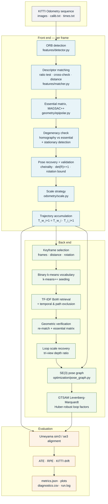
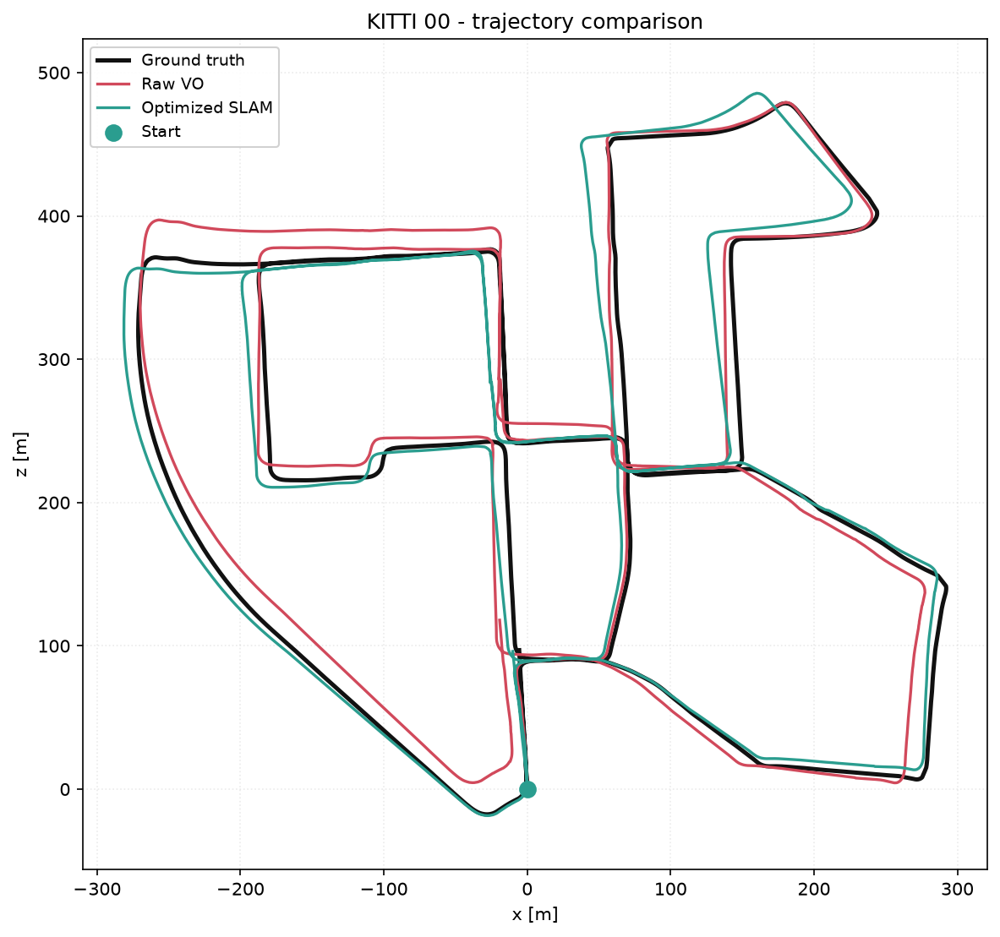
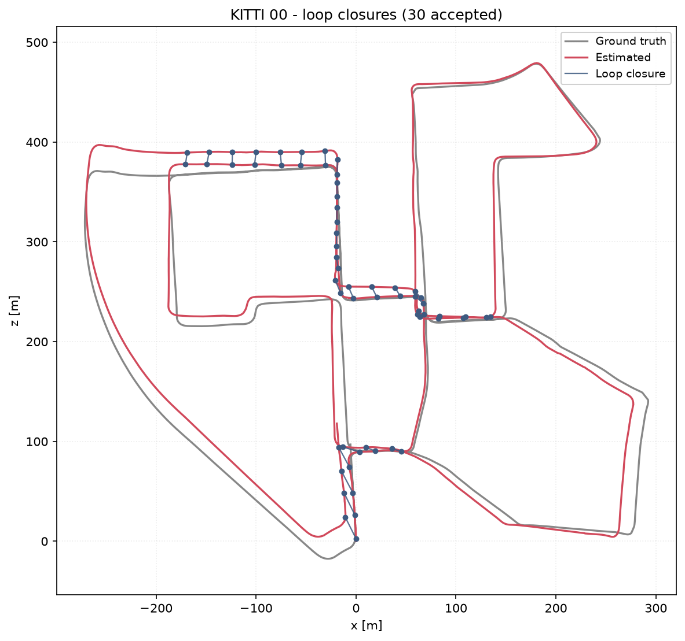
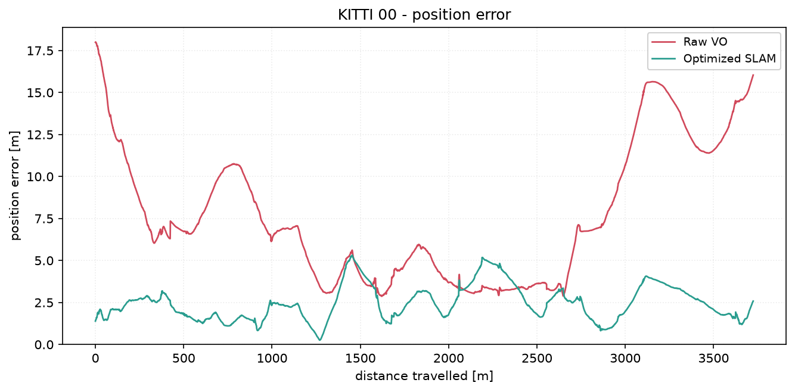
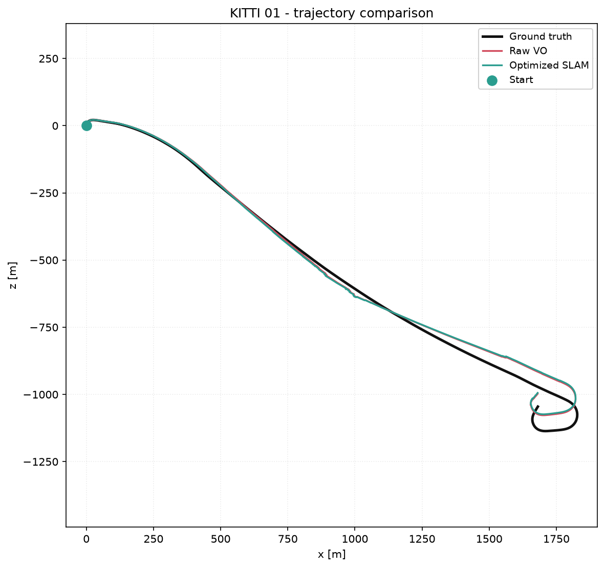
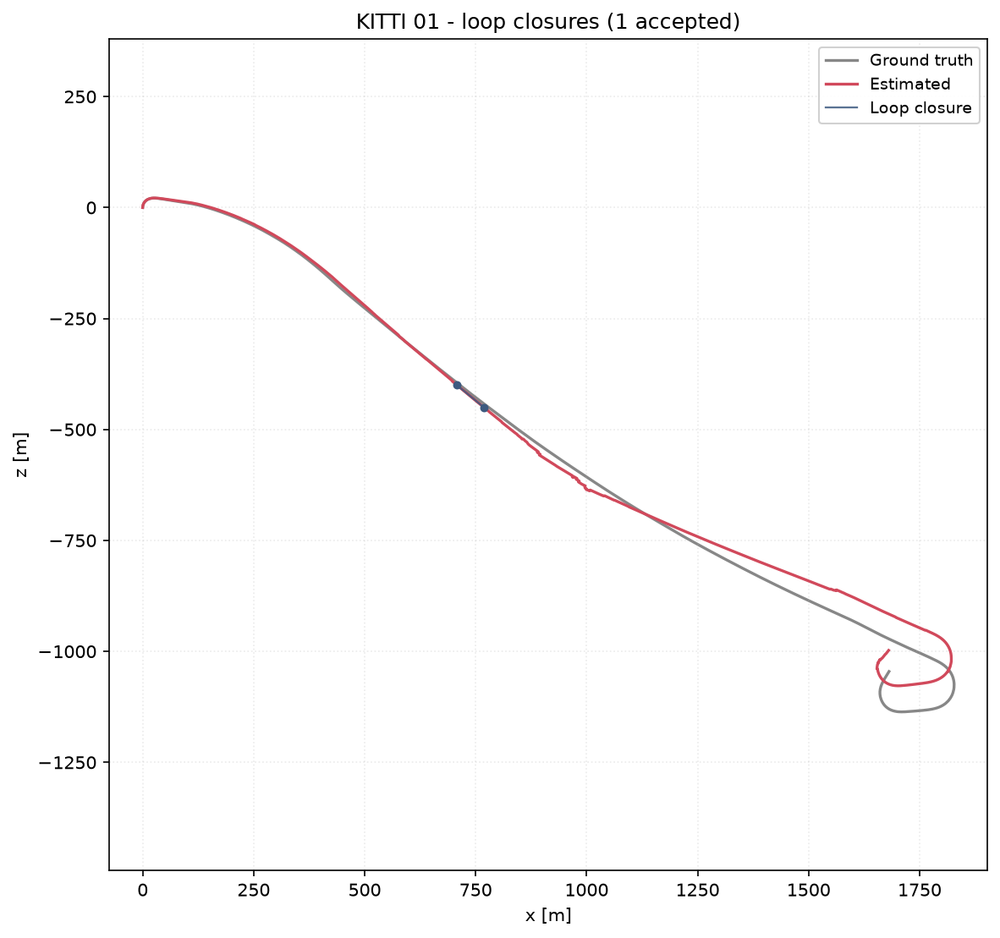
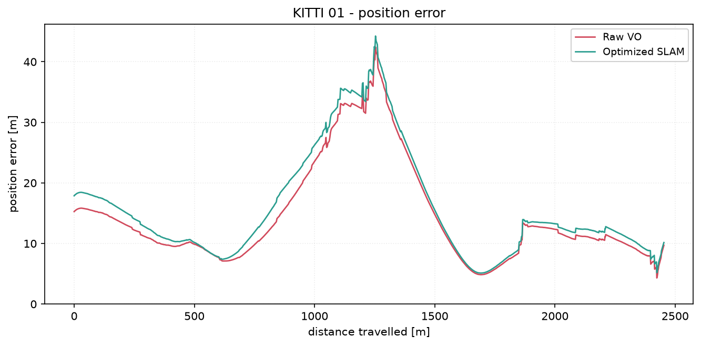
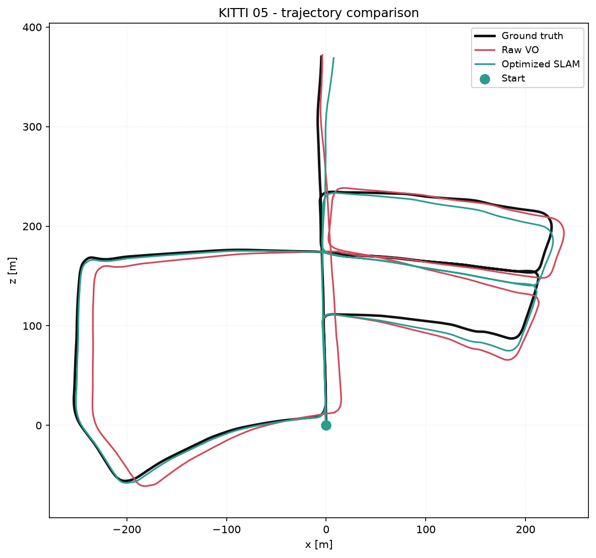
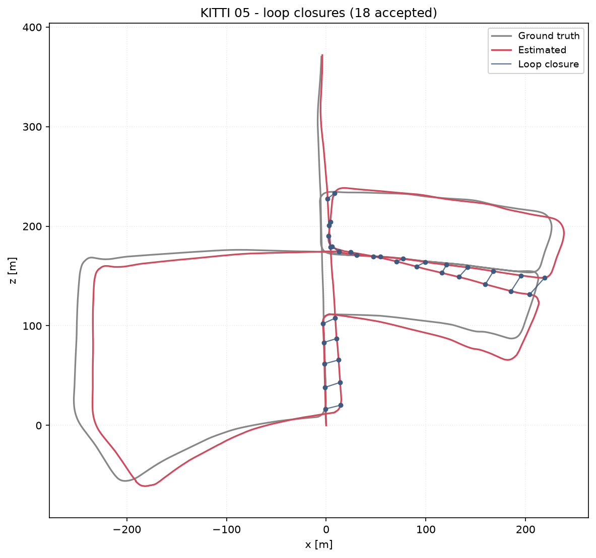
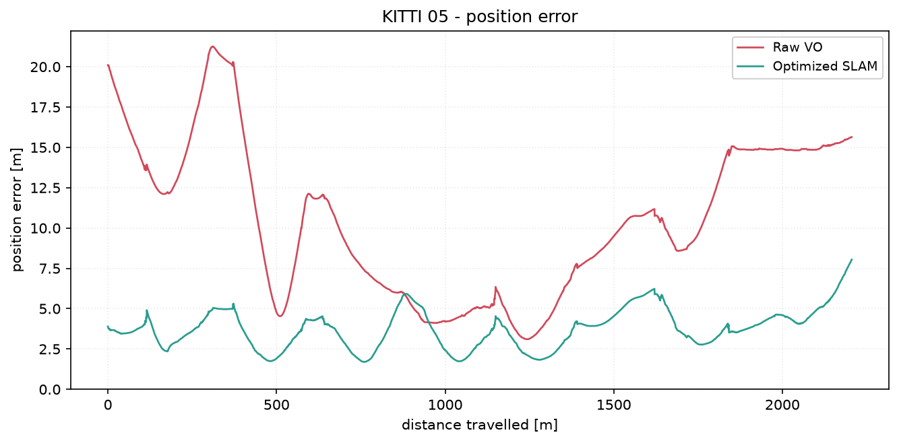

# Monocular Visual SLAM & Localization

A classical monocular visual SLAM system built from scratch in Python, benchmarked on the
[KITTI Odometry](https://www.cvlibs.net/datasets/kitti/eval_odometry.php) dataset.

It estimates a camera trajectory from a **single** image stream, detects revisited places,
optimizes an SE(3) pose graph, and reports quantitative accuracy against ground truth.

Every algorithm that matters is implemented here — feature tracking, essential-matrix motion
estimation, degeneracy detection, bag-of-visual-words loop closure, geometric verification,
monocular scale recovery, pose-graph construction and trajectory evaluation. OpenCV supplies
primitives (ORB, RANSAC, triangulation) and GTSAM supplies the nonlinear solver; nothing is
delegated to an existing SLAM framework.

---

## Table of contents

- [What this system does](#what-this-system-does)
- [Architecture](#architecture)
- [Pipeline walkthrough](#pipeline-walkthrough)
  - [1. Feature extraction](#1-feature-extraction)
  - [2. Feature matching](#2-feature-matching)
  - [3. Essential-matrix pose estimation](#3-essential-matrix-pose-estimation)
  - [4. Monocular scale ambiguity](#4-monocular-scale-ambiguity)
  - [5. Loop closure detection](#5-loop-closure-detection)
  - [6. Pose-graph optimization](#6-pose-graph-optimization)
- [Evaluation on KITTI](#evaluation-on-kitti)
- [Performance](#performance)
- [Results](#results)
- [Installation](#installation)
- [Dataset setup](#dataset-setup)
- [Usage](#usage)
- [Repository structure](#repository-structure)
- [Design decisions](#design-decisions)
- [Limitations](#limitations)
- [Future improvements](#future-improvements)

---

## What this system does

Given a sequence of grayscale images from one calibrated camera, the system:

1. **Tracks** ORB features between consecutive frames.
2. **Estimates** the relative camera motion from the essential matrix, validating every
   estimate rather than trusting the solver.
3. **Accumulates** those motions into a global trajectory.
4. **Recognises** previously visited places using a bag-of-visual-words index built from the
   sequence's own descriptors.
5. **Verifies** each candidate geometrically before accepting it as a loop closure.
6. **Optimizes** the keyframe pose graph with GTSAM to redistribute accumulated drift.
7. **Evaluates** the result against KITTI ground truth with ATE, RPE and the KITTI drift
   metric, reporting raw-versus-optimized figures side by side.

---

## Architecture



---

## Pipeline walkthrough

### 1. Feature extraction

ORB is the default detector: FAST corners with a Harris ranking, described by 256-bit BRIEF
descriptors that are rotation-aware. Binary descriptors matter here for two reasons — Hamming
matching is a POPCNT instruction rather than a floating-point dot product, and the
loop-closure database stores 32 bytes per feature instead of 512.

Configurable via `features.*`: keypoint budget, FAST threshold, pyramid levels and scale
factor, and optional CLAHE contrast equalisation for strongly backlit sequences. SIFT is
available as a drop-in alternative (`features.detector: sift`); the matcher selects the
Hamming or L2 norm automatically from the descriptor dtype, so nothing downstream changes.

*Implementation:* [`features/detector.py`](src/monocular_slam/features/detector.py)

### 2. Feature matching

Matching runs a four-stage filter cascade, because match quality is what determines whether
the essential-matrix estimate is usable at all:

| Stage | Purpose |
|---|---|
| k-NN search (k = 2), brute force | Exact nearest neighbours. At 3000 descriptors/frame the exhaustive search is not the bottleneck, and approximate search would add a second error source. |
| **Lowe's ratio test** (`d₁ < 0.75·d₂`) | The single most effective filter against repetitive structure — road markings, railings, building facades, all ubiquitous in KITTI. |
| **Mutual consistency** (cross-check) | Keeps only mutual nearest neighbours. Applied manually, since OpenCV forbids `crossCheck` together with `knnMatch`. |
| **Absolute distance ceiling** | Rejects matches that pass the relative tests but are simply poor. |

Measured on the full KITTI sequence 00 run: 2980 keypoints per frame on average survive into
1122 filtered correspondences per pair, of which 66.6% become epipolar inliers (751 per pair),
and 91.3% of those inliers then pass the cheirality test.

*Implementation:* [`features/matcher.py`](src/monocular_slam/features/matcher.py)

### 3. Essential-matrix pose estimation

With calibrated correspondences, the essential matrix `E` satisfies `x₂ᵀ E x₁ = 0`. It is
estimated with **MAGSAC++** and decomposed into four candidate poses, of which the cheirality
test (points in front of both cameras) selects one.

**Why MAGSAC++ rather than plain RANSAC.** MAGSAC++ marginalises over the inlier noise scale
instead of committing to one hard threshold. Measured on 250 frames of KITTI sequence 00, at
matched settings:

| Estimator | Mean rotation error | Mean translation-direction error |
|---|---:|---:|
| RANSAC, 1.0 px | 0.274° | 7.36° |
| RANSAC, 0.5 px | 0.167° | 4.58° |
| **MAGSAC++, 0.5 px** | **0.071°** | **2.19°** |

That is a ~4× reduction in per-frame rotation error, which compounds directly into trajectory
drift. The threshold was swept independently; 0.5 px is the point where accuracy plateaus
while the inlier ratio stays healthy.

**Nothing from OpenCV is taken on trust.** Every estimate must pass:

- enough surviving matches, and enough RANSAC inliers;
- all matrices finite (no `NaN`/`Inf`);
- `R` orthonormal with `det(R) = +1` — a reflection is the classic degenerate decomposition;
- enough cheirality inliers, both absolutely and as a fraction of the epipolar inliers;
- a plausible inter-frame rotation (at KITTI's 10 Hz, >30° is a solver failure, not motion).

**Degeneracy detection.** Two configurations break monocular essential-matrix estimation:
a **stationary or purely rotating** camera (with no translation, `E = [t]ₓR` collapses to zero
and RANSAC fits noise) and a **planar scene** (the road surface filling the frame leaves `E`
under-constrained). Both are detected by scoring a homography against the essential matrix on
the same correspondences and comparing via `R_H = S_H / (S_H + S_E)`:

| Motion | `R_H` | Flagged degenerate |
|---|---:|:---:|
| Forward 0.9 m | 0.39 | no |
| Forward 0.9 m + 2° yaw | 0.38 | no |
| Forward with 0.5 px noise | 0.37 | no |
| Pure rotation, 3° | 0.53 | **yes** |
| Pure rotation, 0.5° | 0.51 | **yes** |
| Stationary | 0.50 | **yes** |
| Planar scene | 0.50 | **yes** |

A parallax threshold cannot substitute for this: under pure rotation the *recovered* rotation
is itself wrong, so de-rotating by it leaves a large residual and parallax looks deceptively
healthy. Stationary frames are additionally caught by a median-optical-flow test and held at
the previous pose, which is the correct estimate rather than a fallback.

*Implementation:* [`geometry/epipolar.py`](src/monocular_slam/geometry/epipolar.py)

### 4. Monocular scale ambiguity

> **This is the fundamental limitation of monocular vision, and this project does not paper
> over it.**

A single moving camera observing a rigid scene **cannot recover absolute scale**. The
essential matrix is defined only up to scale, so decomposing it yields a translation
*direction* with unit norm and nothing more. A car driving 1 m past a 4 m wall produces pixel
motion identical to a model car driving 10 cm past a 40 cm wall. No amount of feature
matching or bundle adjustment resolves this — it requires information from outside the image
stream: a stereo baseline, an IMU, a wheel odometer, a known object size, or an assumption
such as constant camera height above the ground plane.

The system therefore keeps scale **strictly separate** from geometry. The pose estimator
produces unit-norm translation directions; a pluggable `ScaleEstimator` supplies the
magnitude; the trajectory builder multiplies them. Three strategies ship:

| `odometry.scale_source` | What it does | Honest description |
|---|---|---|
| `ground_truth` *(default)* | Takes the per-transition translation magnitude from KITTI ground truth. | **Evaluation aid, not a SLAM capability.** Isolates rotational and directional drift — the parts monocular VO genuinely estimates — so trajectory shape and loop-closure benefit can be benchmarked. This is the standard protocol for reporting monocular VO on KITTI and must always be labelled as such. |
| `constant` | Assumes a fixed distance per frame. | Genuinely scale-free with respect to ground truth. Reasonable on constant-speed stretches, degrades badly through stops and turns. |
| `none` | Every step has unit length. | Pure monocular output. Trajectory shape is meaningful, units are arbitrary. Combined with Umeyama **sim3** alignment (which fits a global scale factor), this yields honest scale-free metrics. |

Every run records which strategy was used. `metrics.json` carries
`"scale_uses_ground_truth": true|false`, the CLI prints a warning banner, and the generated
resume summary attaches the caveat to any claim derived from a ground-truth-scaled run.

**Results labelled `ground_truth` are not absolute-scale monocular localization results.**

*Implementation:* [`odometry/scale.py`](src/monocular_slam/odometry/scale.py)

### 5. Loop closure detection

Naively comparing each keyframe against every past keyframe by brute-force descriptor
matching is O(N_kf · 3000 · 3000) Hamming comparisons per query — minutes per query by the end
of a sequence, growing quadratically. Instead each keyframe is reduced to one fixed-length
bag-of-visual-words vector, and retrieval becomes a single matrix–vector product.

**Vocabulary.** Clustered from the sequence's own ORB descriptors, using **binary k-means**:
Hamming distance with majority-vote centroids. Euclidean k-means on the raw descriptor bytes
would be meaningless, since byte `0xFF` and `0x00` differ by 8 bits but 255 units. Seeding uses
**k-means++**, which matters more than it might seem — with uniform random seeds, clustering
routinely split one true descriptor cluster across two words while merging others.

Vocabulary size was chosen by measuring true-loop retrieval on KITTI sequence 00
(1595 keyframes, 3745 ground-truth loop pairs):

| Words | Train time | Recall@5 | Candidate precision |
|---:|---:|---:|---:|
| 256 | 4.7 s | 41.2% | 6.8% |
| 512 | 9.0 s | 46.6% | 11.3% |
| **1024** | **17.4 s** | **48.5%** | **14.1%** |
| 2048 | 25.9 s | 49.0% | 15.8% |

1024 is the operating point: 2048 adds ~0.5 points of recall for 1.5× the clustering cost.

**Acceptance cascade.** A candidate must pass every stage:

1. **BoW cosine similarity**, with TF-IDF weighting so that words appearing in nearly every
   keyframe (sky, road texture, lane markings) carry no vote about *where* the camera is.
2. **Temporal and spatial exclusion** — candidates must be at least *N* keyframes older **and**
   a minimum travelled distance away. The path-distance test is what protects a stationary
   vehicle, which accumulates keyframe ids without moving.
3. **Normalised similarity** — the candidate must score a minimum fraction of the best score
   among the query's own temporal neighbours. This adapts to scene texture instead of trusting
   one absolute threshold everywhere.
4. **Descriptor re-matching** with the full front-end filter cascade.
5. **Geometric verification** — a robust essential matrix must fit those correspondences with
   enough inliers and a high enough inlier ratio. A false positive from perceptual aliasing
   will match descriptors but will not admit a single consistent camera motion.
6. **Metric plausibility** — the recovered translation magnitude (below) must be small enough
   for the two keyframes to genuinely be the same place.
7. **Cooldown** — after acceptance, detection pauses briefly so one revisit does not generate a
   burst of near-duplicate constraints.

**Recovering the loop translation magnitude.** The essential matrix gives the loop's rotation
and translation *direction*; the magnitude is unobservable, exactly as in the front end. The
obvious shortcut — take it from the odometry-estimated gap between the two keyframes — is
wrong in the most damaging possible way: **when the trajectory has drifted, that gap *is* the
drift.** Measured on sequence 00, the odometry gap across accepted loops averaged **10.9 m**
against a true separation of **2.6 m**. Feeding that in bakes the drift into the very
constraint meant to remove it, and made the optimized trajectory measurably *worse* than the
raw one.

The magnitude is instead recovered from **shared scene structure**:

1. Triangulate the loop pair's correspondences with the unit-norm relative pose — structure
   correct up to the unknown factor `s`.
2. Triangulate the query keyframe against an odometry neighbour, whose relative pose *is*
   metric — the same scene at true scale.
3. For features seen in all three views, `s = depth_metric / depth_unit`. A trimmed median
   over those ratios is the estimate.

**The recovered magnitude is also the strongest false-positive filter.** Geometric verification
cannot catch every look-alike: on a repetitive corridor — a highway with guardrails, lane
markings and uniform vegetation — two points 80 m apart look alike *and* admit a perfectly
consistent camera motion, because "straight road ahead" is a valid relative pose. Appearance
and geometry both say yes. On KITTI sequence 01 that produced nine confident detections whose
true separation was 73–108 m, and feeding them to the optimizer made ATE 29% *worse*.

The recovered magnitude breaks the tie, because a genuine revisit puts the camera within a few
metres of where it was:

| | True separation | Recovered magnitude |
|---|---|---|
| **True loops** (sequences 00, 05) | 0.3 – 14.3 m (median 1.2 m) | **0.12 – 8.58 m** |
| **False positives** (sequence 01) | 73.5 – 108.5 m | **12.9 – 27.4 m** |

The two populations do not overlap, so `max_loop_scale_m` (10 m) is a *physical plausibility*
gate rather than a numerical sanity bound. By the same reasoning, a loop whose magnitude
cannot be measured at all is one that cannot be confirmed as a revisit, so it is rejected by
default; setting `require_measured_scale: false` instead keeps it as an orientation-only
constraint with a heavily inflated translation sigma.

Note also how well the recovery itself works: on sequence 05 the estimates track ground truth
almost exactly (0.4 ↔ 0.3, 1.7 ↔ 1.7, 0.8 ↔ 0.7, 1.4 ↔ 1.4 m).

*Implementation:* [`loop_closure/database.py`](src/monocular_slam/loop_closure/database.py),
[`loop_closure/detector.py`](src/monocular_slam/loop_closure/detector.py)

### 6. Pose-graph optimization

The back end discards image measurements and keeps only the *relative pose constraints* they
implied:

- **Nodes** — keyframe poses `T_w_kf`, the variables being solved for.
- **Odometry edges** — the relative motion the front end integrated between consecutive
  keyframes.
- **Loop edges** — the relative pose that geometric verification recovered.

Without a loop edge the graph is a chain, and a chain has exactly one solution: the odometry
itself. Loop edges introduce **cycles** whose constraints are mutually inconsistent because of
accumulated drift, and the optimizer redistributes that inconsistency over the whole cycle
instead of leaving it concentrated at the seam.

GTSAM minimises

```
argmin_X  Σ_edges ‖ log( Z_ij⁻¹ (X_i⁻¹ X_j) ) ‖²_Σij
```

with Levenberg–Marquardt. Each residual is the SE(3) discrepancy between the measured relative
pose and the one the current estimates imply, expressed in the tangent space and weighted by
that edge's covariance.

**Noise model assumptions** (all configurable under `pose_graph.*`):

- A very tight **prior** anchors the first pose. The graph is determined only up to a global
  rigid transform, so the gauge freedom must be fixed somewhere or the linear system is rank
  deficient.
- **Odometry edges** get moderate, constant diagonal sigmas. This is a deliberate
  simplification — propagating a full covariance would need uncertainty estimates the
  essential-matrix decomposition does not provide.
- **Loop edges** get looser translation sigmas than odometry, because their magnitude comes
  from a triangulated ratio rather than direct measurement.
- **Loop factors are wrapped in a Huber kernel.** A single false positive asserts that two
  unrelated places are the same, and under pure least squares that one enormous residual can
  drag the whole trajectory with it. Huber bounds its influence — cheap insurance for a
  detector that cannot be perfect.

Sigma vectors are built **rotation-first** (`[rx, ry, rz, tx, ty, tz]`) to match GTSAM's
`Pose3` tangent-space ordering; getting that backwards silently swaps rotational and
translational confidence and produces a plausible-looking but wrong solution. Every pose is
re-projected onto SO(3) before conversion, since a VO pose that has been through thousands of
matrix products drifts far enough from orthonormal that `Rot3` rejects it.

**Propagating corrections to every frame.** The pose graph optimizes keyframes, but evaluation
compares against ground truth at every frame. Each frame receives the correction from its
*preceding* keyframe, which leaves the front end's inter-keyframe odometry exactly intact.
Blending between adjacent keyframes would distort the best local information available; the
cost is a small discontinuity at each keyframe boundary, bounded by how far the optimizer
moved that keyframe.

*Implementation:* [`optimization/pose_graph.py`](src/monocular_slam/optimization/pose_graph.py),
[`optimization/gtsam_backend.py`](src/monocular_slam/optimization/gtsam_backend.py)

---

## Evaluation on KITTI

Three complementary metric families, because each answers a different question and none is
sufficient alone.

### Trajectory alignment

An estimated trajectory lives in its own coordinate frame — it starts at the identity with an
arbitrary orientation and, for monocular VO, an arbitrary scale. Comparing raw coordinates
would measure the frame mismatch, not the quality of the estimate. **Umeyama alignment** finds
the closed-form least-squares similarity transform between the two point sets.

- **`sim3`** (7 DoF, default) also fits a global scale factor. Correct for a pure monocular
  trajectory whose scale is unobservable by construction; metrics afterwards measure trajectory
  *shape*.
- **`se3`** (6 DoF) fixes scale at 1. Appropriate when the trajectory is already metric, because
  it keeps residual scale drift visible in the error rather than absorbing it.
- **`none`** produces unaligned metrics.

Both aligned and unaligned ATE are always reported; the distinction is not cosmetic for a
monocular system.

### Metric definitions

| Metric | Definition | What it measures |
|---|---|---|
| **ATE RMSE** | RMS Euclidean distance between corresponding camera positions after alignment | Global consistency. Dominated by low-frequency drift — one early heading error inflates it for the rest of the sequence. This is the metric loop closure most visibly improves. |
| **ATE mean / median / std / min / max** | Same error distribution, other statistics | Distribution shape. `RMSE² = mean² + std²` holds exactly. |
| **RPE (translation)** | ‖translation of `(T_gt,i⁻¹T_gt,i+δ)⁻¹(T_est,i⁻¹T_est,i+δ)`‖, metres | Local accuracy, invariant to global drift — isolates front-end quality. |
| **RPE (rotation)** | Geodesic angle of the same error transform, degrees | Local rotational accuracy. |
| **Translational drift** | Translation error over 100–800 m sub-trajectories, ÷ sub-trajectory length | The KITTI leaderboard metric. Normalising by *distance* rather than frame count makes results comparable across sequences of different speed and length. |
| **Rotational drift** | Same protocol, rotation error in degrees per 100 m | Heading drift rate. |
| **Successful pose rate** | validated relative poses ÷ attempted transitions | Front-end robustness. A correctly detected stationary frame counts as a success, since holding position is the right answer there. |
| **ATE reduction** | `(ATE_raw − ATE_opt) / ATE_raw × 100` | The back end's measured contribution. |

Rotation angles use `atan2(sin θ, cos θ)` rather than `arccos` of the trace. The arccos form is
ill-conditioned near identity — its derivative is unbounded there, so ~1e-16 of rounding error
in the trace inflates to ~1e-8 rad, putting a spurious 1e-5° floor under the relative pose
error between two similar trajectories.

*Implementation:* [`evaluation/metrics.py`](src/monocular_slam/evaluation/metrics.py),
[`evaluation/alignment.py`](src/monocular_slam/evaluation/alignment.py)

---

## Performance

Every run is instrumented per stage with `time.perf_counter`; the totals land in
`metrics.json` under `timing.stages` and are printed to `run.log`. The overhead is two clock
reads per call, negligible against ~7 ms of ORB detection, so instrumentation is always on
rather than behind a flag.

Measured on the full KITTI sequence 00 run (4541 frames, single CPU core):

| Stage | Total | Per call | Calls |
|---|---:|---:|---:|
| Pose estimation (MAGSAC++ E-matrix, decomposition, model selection) | 120.8 s | 26.6 ms | 4540 |
| Loop detection (re-match + verify candidates) | 86.2 s | — | 1 pass |
| Descriptor matching | 40.8 s | 9.0 ms | 4540 |
| ORB detection | 33.9 s | 7.5 ms | 4541 |
| Vocabulary training (binary k-means, 1024 words) | 17.5 s | — | 1 |
| BoW index construction | 9.0 s | — | 1 |
| **Pose-graph optimization (GTSAM LM, 1595 nodes)** | **0.08 s** | — | 1 |

Two things stand out. The back end is essentially free — 79 ms to optimize a 1595-node graph,
against roughly five minutes of front-end work; a pose graph is a far cheaper object than the
images that produced it. And pose estimation, not feature extraction, dominates: MAGSAC++
buys its 4× accuracy improvement at roughly 3× the cost of plain RANSAC, which is a trade
worth making when drift compounds over thousands of frames.

The obvious remaining bottleneck is loop-closure verification, which re-matches full
descriptor sets for every surviving candidate. A hierarchical vocabulary with a direct index
would prune most of those before matching.

---

## Results

<!-- RESULTS:START -->
> **All figures below are from real runs of this repository on KITTI Odometry.** They use `odometry.scale_source: ground_truth`, which takes the per-frame translation *magnitude* from ground truth. Monocular vision cannot recover absolute scale; the estimator recovers translation *direction* and full rotation. These numbers therefore measure trajectory shape, heading drift and loop-closure benefit — **not** metric-scale localization. See [Monocular scale ambiguity](#4-monocular-scale-ambiguity).

| Sequence | Frames | Distance | Pose rate | Loops | ATE RMSE (raw) | ATE RMSE (opt.) | ATE reduction | Drift (raw) | Drift (opt.) | Rot. drift | FPS |
|---:|---:|---:|---:|---:|---:|---:|---:|---:|---:|---:|---:|
| 00 | 4541 | 3.72 km | 99.8% | 30 | 8.42 m | 2.70 m | 68.0% | 1.59% | 1.25% | 0.837 | 14.0 |
| 01 | 1101 | 2.45 km | 99.9% | 1 | 16.21 m | 17.67 m | -9.0% | 3.30% | 3.37% | 0.987 | 15.8 |
| 05 | 2761 | 2.21 km | 99.6% | 18 | 11.88 m | 4.03 m | 66.1% | 2.44% | 1.71% | 1.180 | 15.1 |

### Front-end statistics

| Sequence | Keyframes | Avg. features/frame | Avg. matches/pair | Avg. RANSAC inlier ratio |
|---:|---:|---:|---:|---:|
| 00 | 1595 | 2980 | 1122 | 66.6% |
| 01 | 923 | 2698 | 931 | 71.7% |
| 05 | 972 | 2979 | 1168 | 66.3% |

### Highlights

- Processed **8,403 KITTI frames** across **8.38 km** of driving (sequences 00, 01, 05).
- Achieved a **99.6-99.9% successful relative-pose rate** across all evaluated sequences.
- Achieved **2.70 m optimized ATE RMSE** on sequence 00 (3.72 km, sim3 alignment).
- Achieved **1.25% translational drift** on sequence 00 (KITTI 100-800 m sub-trajectory metric).
- Reduced ATE RMSE by **68.0%** on sequence 00 (8.42 m -> 2.70 m) via loop closure and pose-graph optimization.
- Detected and geometrically verified **49 loop closures** (30 on sequence 00).
- Ran the full pipeline at **14.0-15.8 FPS** on CPU, end to end including loop closure and optimization.

### Where it does not help

- **Sequence 01**: optimization made ATE *worse* (16.21 m -> 17.67 m, -9.0%) from 1 accepted loop closure.

  KITTI sequence 01 is a fast highway drive that contains **no true loops**, so the
  correct number of closures is zero. Its repetitive corridor (guardrails, lane
  markings, uniform vegetation) defeats appearance matching *and* geometric
  verification, because forward motion along a straight road is a consistent camera
  motion between any two points on it. The metric-plausibility gate removes most such
  detections; the residual ones remain a known limitation, and switchable constraints
  or GNC would be the proper fix.

### Trajectories

**Sequence 00**



*Ground truth vs raw VO vs optimized SLAM.*



*Accepted loop-closure edges.*



*Position error against distance travelled.*

**Sequence 01**



*Ground truth vs raw VO vs optimized SLAM.*



*Accepted loop-closure edges.*



*Position error against distance travelled.*

**Sequence 05**



*Ground truth vs raw VO vs optimized SLAM.*



*Accepted loop-closure edges.*



*Position error against distance travelled.*

_Regenerate with `python scripts/report.py --update-readme`._
<!-- RESULTS:END -->

---

## Installation

Requires **Python 3.10+**.

```bash
git clone https://github.com/sohamkundu27/Monocular-Visual-SLAM-Localization.git
cd Monocular-Visual-SLAM-Localization

python3 -m venv .venv
source .venv/bin/activate

pip install -r requirements.txt
pip install -e .
```

> **NumPy pin.** `gtsam` 4.2 wheels are compiled against the NumPy 1.x ABI, so the whole stack
> is held below NumPy 2.0. This is specified in `pyproject.toml` and `requirements.txt`.

Verify the install:

```bash
pytest -q
python scripts/run_slam.py --help
```

The test suite runs entirely on synthetic data and needs no dataset download.

---

## Dataset setup

Download the **KITTI Odometry** grayscale images and ground-truth poses from the
[official page](https://www.cvlibs.net/datasets/kitti/eval_odometry.php) (registration
required):

- `data_odometry_gray.zip` — left/right grayscale images (~22 GB)
- `data_odometry_poses.zip` — ground-truth poses for sequences 00–10
- `data_odometry_calib.zip` — calibration files

Unzip into a single root so the layout is:

```
<KITTI_ROOT>/
├── sequences/
│   ├── 00/
│   │   ├── calib.txt
│   │   ├── times.txt
│   │   ├── image_0/      # left grayscale — the monocular SLAM camera
│   │   │   ├── 000000.png
│   │   │   └── ...
│   │   └── image_1/
│   └── ...
└── poses/
    ├── 00.txt
    └── ...
```

Sequences 00–10 ship with ground truth; 11–21 are the held-out test split. The pipeline runs
on those too, and reports trajectory metrics as `null` rather than inventing them.

Point the tools at `<KITTI_ROOT>` with `--dataset-path`, or set `dataset.path` in
`configs/kitti.yaml`. **No dataset files are ever written into this repository.**

---

## Usage

### Full SLAM

```bash
python scripts/run_slam.py \
    --sequence 00 \
    --dataset-path /path/to/KITTI/dataset \
    --config configs/kitti.yaml
```

Writes to `outputs/sequence_00/`:

| File | Contents |
|---|---|
| `metrics.json` | Every measured metric, plus provenance and per-stage timings |
| `trajectory_raw.png` | Raw VO against ground truth (top-down x–z) |
| `trajectory_optimized.png` | Post-optimization trajectory against ground truth |
| `trajectory_comparison.png` | Ground truth, raw and optimized overlaid |
| `trajectory_3d.png` | 3D view, where vertical drift is visible |
| `loop_closures.png` | Accepted loop edges drawn on the trajectory |
| `error_over_time.png` | Per-frame position error against distance travelled |
| `diagnostics.png` | Matches, inlier ratio, rotation and cumulative failures |
| `diagnostics.csv` | Per-frame front-end record |
| `trajectory_raw.txt`, `trajectory_optimized.txt` | KITTI-format poses (readable by `evo`) |
| `config.resolved.yaml` | Fully resolved config, for reproducibility |
| `run.log` | Complete run log |

### Other entry points

```bash
# Visual odometry only (no loop closure, no optimization)
python scripts/run_vo.py --sequence 05 --dataset-path /path/to/KITTI/dataset

# Quick smoke run on 300 frames
python scripts/run_slam.py -s 00 --dataset-path /path/to/KITTI/dataset --max-frames 300

# Genuinely scale-free monocular, no ground-truth assistance
python scripts/run_slam.py -s 00 --dataset-path /path/to/KITTI/dataset \
    --set odometry.scale_source=none

# Re-score saved trajectories without re-running the pipeline
python scripts/evaluate.py outputs/sequence_00/trajectory_raw.txt \
    --compare outputs/sequence_00/trajectory_optimized.txt \
    --sequence 00 --dataset-path /path/to/KITTI/dataset

# Regenerate the resume metrics summary from completed runs
python scripts/report.py --outputs outputs
```

### Configuration

Every tunable lives in [`configs/kitti.yaml`](configs/kitti.yaml), typed and validated by
`src/monocular_slam/config.py`. Unknown keys are **rejected**, not ignored — a typo that
silently reverts a threshold to its default is very hard to spot in an experiment log.

Override anything from the command line:

```bash
python scripts/run_slam.py -s 00 --dataset-path /path/to/kitti \
    --set features.max_features=4000 \
    --set odometry.ransac_threshold_px=0.75 \
    --set loop_closure.min_inliers=60
```

Runs are deterministic: Python, NumPy and OpenCV RNGs are all seeded from `runtime.seed`.

---

## Repository structure

```
.
├── configs/
│   └── kitti.yaml                    # all tunables, typed and validated
├── scripts/                          # thin wrappers runnable from a checkout
│   ├── run_slam.py  run_vo.py  evaluate.py  report.py
├── src/monocular_slam/
│   ├── config.py                     # typed config, YAML + dotted overrides
│   ├── pipeline.py                   # end-to-end orchestration and outputs
│   ├── reporting.py                  # resume metrics generation
│   ├── cli/                          # argument parsing and entry points
│   ├── datasets/
│   │   ├── calibration.py            # KITTI calib.txt, pinhole model
│   │   └── kitti.py                  # sequence loader, ground truth, timestamps
│   ├── features/
│   │   ├── detector.py               # ORB / SIFT
│   │   └── matcher.py                # filter cascade + visualisation
│   ├── geometry/
│   │   ├── transforms.py             # SE(3)/SO(3) primitives, Lie maps
│   │   ├── pose.py                   # Trajectory container
│   │   └── epipolar.py               # essential matrix, pose recovery, degeneracy
│   ├── odometry/
│   │   ├── scale.py                  # pluggable monocular scale strategies
│   │   └── visual_odometry.py        # front end + trajectory accumulation
│   ├── loop_closure/
│   │   ├── database.py               # keyframes, binary vocabulary, TF-IDF BoW
│   │   └── detector.py               # retrieval, verification, scale recovery
│   ├── optimization/
│   │   ├── pose_graph.py             # framework-agnostic SE(3) graph
│   │   └── gtsam_backend.py          # GTSAM factor graph and solver
│   ├── evaluation/
│   │   ├── alignment.py              # Umeyama sim3 / se3
│   │   ├── metrics.py                # ATE, RPE, KITTI drift
│   │   └── plotting.py               # all figures
│   └── utils/                        # logging, seeding, timing
├── tests/                            # runs without the KITTI download
├── docs/results/                     # published figures the README renders
└── outputs/                          # git-ignored, except resume_metrics.md
    └── sequence_XX/                  # one directory per benchmark run
```

---

## Design decisions

**Scale is separated from geometry.** The pose estimator only ever produces unit-norm
directions. Everything about magnitude lives behind a `ScaleEstimator` interface, so swapping
in a stereo, IMU or ground-plane estimator touches one object. It also makes it structurally
impossible to accidentally claim metric accuracy from a scale-free run.

**Failures are recorded, not hidden.** A 4541-frame sequence *will* contain transitions that
cannot be solved. Each resolves to `ok`, `stationary` (the correct estimate when the vehicle is
stopped) or `failed` (constant-velocity prediction, counted against the success rate). All
three land in `diagnostics.csv`.

**OpenCV output is validated.** `findEssentialMat` can return `None`, a stack of candidate
matrices, or `NaN`; `recoverPose` can return a reflection. Each is checked explicitly rather
than discovered as a corrupted trajectory 2000 frames later.

**Thresholds were measured, not guessed.** The MAGSAC++ switch, the 0.5 px threshold, the
1024-word vocabulary, the raised cheirality distance and the 10 m loop-plausibility gate each
came from a measurement on real KITTI frames; the numbers are in this README and in the code
comments. Two of them — the loop translation source and that plausibility gate — were changed
*because* an initial implementation made the optimized trajectory worse than the raw one, and
the measurement said why.

**The pose graph is framework-agnostic.** `PoseGraph` is plain NumPy with its own validation
and residual diagnostics; `gtsam_backend.py` is the only file that imports GTSAM, and it does
so lazily so the front end and metrics work without it.

**Structural problems are caught before the solver sees them.** Disconnected components, invalid
SE(3), self-loops and non-positive sigmas produce an actionable message instead of GTSAM's
`IndeterminantLinearSystemException` from deep inside the linear algebra.

**Unmeasured values are `null`.** No metric is ever defaulted or estimated. The resume
generator refuses to build a claim from a value that was not measured.

---

## Limitations

- **No absolute scale.** By construction. See
  [Monocular scale ambiguity](#4-monocular-scale-ambiguity). The default benchmarking mode
  borrows per-frame magnitudes from ground truth and is labelled as such everywhere.
- **No bundle adjustment.** Poses are refined by pose-graph optimization only; landmarks are
  triangulated for scale recovery and degeneracy checks, but never jointly optimized. Full
  local BA would tighten the front end considerably.
- **Two-view front end.** Motion comes from consecutive image pairs, not a persistent local
  map. There is no feature-track lifetime longer than one frame pair, so no multi-view
  constraint stabilises the estimate.
- **Sequence-specific vocabulary.** Clustered from each sequence's own descriptors, which keeps
  the project self-contained but is not transferable. A deployment would train once offline on
  a large corpus.
- **Flat vocabulary.** A single-level 1024-word vocabulary, not a hierarchical DBoW2 tree.
  Recall@5 for true loops is ~48% on sequence 00; a hierarchical vocabulary with direct-index
  filtering would do better.
- **Repetitive scenes still stress loop closure.** On a highway, appearance retrieval *and*
  geometric verification both accept places 80 m apart. The metric-plausibility gate catches
  them here, but it is a last line of defence: a scene where a look-alike also sits within a
  few metres of the query would defeat it. Sequence 01 has no true loops, so the system's
  correct behaviour there is to find none.
- **Constant diagonal noise models.** Real per-edge covariances from the estimator would weight
  the graph better than hand-set sigmas.
- **No relocalization or map persistence.** The system runs one sequence start to finish; it
  cannot recover from total tracking loss, nor save and reload a map.
- **CPU-bound.** No GPU acceleration, no multi-threading. Throughput is reported per run.

---

## Future improvements

1. **Local bundle adjustment** over a sliding window of keyframes and landmarks — the largest
   single accuracy win available, and the main structural gap versus ORB-SLAM.
2. **Persistent feature tracks** across multiple frames, replacing pairwise matching with
   multi-view constraints.
3. **Sim(3) loop constraints** so scale drift is corrected by the optimizer rather than
   sidestepped, which is what monocular ORB-SLAM does.
4. **Ground-plane scale estimation** — assume a known camera height, fit the road plane, and
   recover genuine metric scale from images alone.
5. **Hierarchical vocabulary** (DBoW2-style tree with a direct index) for better recall and
   faster verification.
6. **Uncertainty-aware noise models**, propagating the essential-matrix covariance into edge
   weights.
7. **Switchable constraints or GNC** for loop edges, letting the optimizer disable false
   positives outright rather than merely down-weighting them.
8. **IMU pre-integration** for a visual-inertial front end with observable metric scale.

---

## References

- H. Longuet-Higgins, *A computer algorithm for reconstructing a scene from two projections*,
  Nature, 1981.
- D. Nistér, *An efficient solution to the five-point relative pose problem*, IEEE TPAMI, 2004.
- S. Umeyama, *Least-squares estimation of transformation parameters between two point
  patterns*, IEEE TPAMI, 1991.
- A. Geiger, P. Lenz, R. Urtasun, *Are we ready for Autonomous Driving? The KITTI Vision
  Benchmark Suite*, CVPR, 2012.
- J. Sturm et al., *A Benchmark for the Evaluation of RGB-D SLAM Systems*, IROS, 2012.
- D. Gálvez-López, J. D. Tardós, *Bags of Binary Words for Fast Place Recognition in Image
  Sequences*, IEEE T-RO, 2012.
- R. Mur-Artal, J. M. M. Montiel, J. D. Tardós, *ORB-SLAM: A Versatile and Accurate Monocular
  SLAM System*, IEEE T-RO, 2015.
- D. Barath et al., *MAGSAC++, a fast, reliable and accurate robust estimator*, CVPR, 2020.
- F. Dellaert, *Factor Graphs and GTSAM: A Hands-on Introduction*, 2012.

---

## License

MIT
